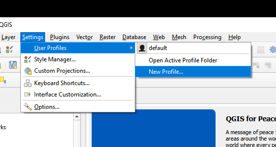
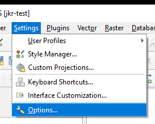
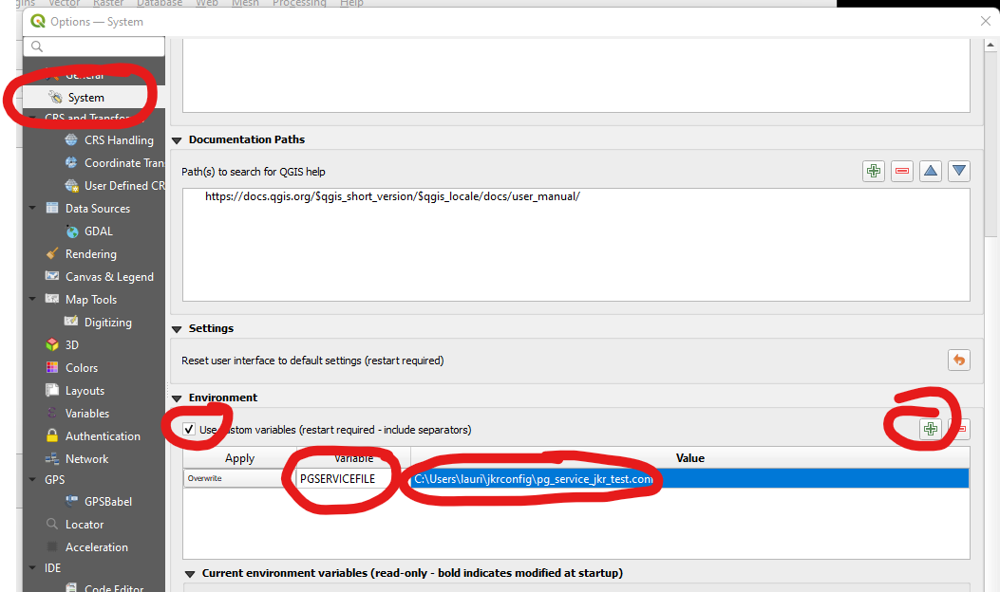
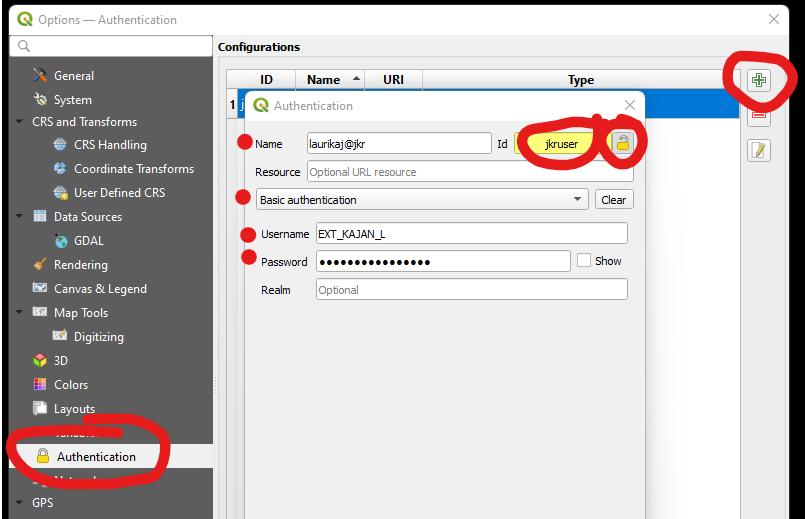
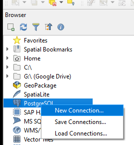
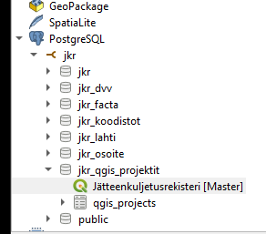

# Jätteenkuljetusrekisteri Core

This repository contains core parts of Jätteenkuljetusrekisteri including the data model and the importer tool.

This project is intended to be extended by customer specific modifications etc. import format plugins etc.


## Installing

You probably want install this to a virtual environment so your system python don't get cluttered of dependencies.
```bash
$ python -m venv jkr-venv
$ jkr-venv\scripts\activate
```

Download the whl file etc. `jkr-0.1.0-py3-none-any.whl`
```bash
(jkr-venv) $ pip install jkr-0.1.0-py3-none-any.whl
```

Now import script can be started
```bash
(jkr-venv) $ jkr import SIIRTOTIEDOSTO TIEDONTUOTTAJA
```

## Setting up a dev environment

The development environment uses [Poetry](https://python-poetry.org/). Install it before anything.

```bash
$ git clone https://github.com/GispoCoding/jkr-core.git
$ cd jkr-core

$ poetry install
```

### Db env

Install docker and docker-compose (version >= 1.28.0)

Copy .env.template to .env and change parameters
```bash
$ cp .env.template .env

# Edit the .env file
$ nano .env
```

```bash
docker-compose up db -d
docker-compose up flyway
```

## Handling database model changes
The diff operation in pgModeler is quite fragile and not recommended used directly.

We use Flyway (for now) to generate database migrations. Flyway is a SQL file based migration system.
PgModeler is used to generate diff SQL files and then Flyway is used to apply the migrations.

### Create the initial migration
```bash
pgmodeler-cli.exe --export-to-file --input jkr.dbm --output migrations/V1__initial.sql --pgsql-ver 12.0
```

### Creating incremental migrations
```bash
# 1. Verify db is up to date (all current migrations applied) by running 
docker-compose up flyway

# 2. Modify the pgmodeler model

# 3. Create a diff file. Change the conn-alias and output file.
pgmodeler-cli.exe --diff --save --input jkr.dbm --compare-to jkr --conn-alias local-db --output migrations/V2__add_sailio_table.sql --pgsql-ver 12.0

# 4. Validate and modify the migration file

# 5. Migrate by running 
docker-compose up flyway

# 6. Verify all changes in model are apllied to the database by executing step 3 again and checking that no diff is generated.
```

**Repairing migrations**
```bash
docker-compose run --rm flyway repair
```

### Running migrations against different platform
```bash
docker-compose run --rm flyway migrate -user=jkr_admin -password=<password> -url=jdbc:postgresql://trepx-paikka1.tre.t.verkko:5432/ymparisto_test_db
```

## Using the QGIS project

The QGIS project reads data from a PostgreSQL service named `jkr` with a QGIS authentication which id is `jkruser`.

1. Create a PostgreSQL service file for each environment (Development, Testing, Production) to some folder for example in `<your home folder>/jkrconfig/`. Name the files for example `pg_service_jkr_dev.conf`, `pg_service_jkr_test.conf`, `pg_service_jkr_prod.conf`. Add the following with correct values for each environment:
```ini
[jkr]
host=localhost
port=5435
dbname=ymparisto_db
```
2. Create a QGIS-profile for each environment (Development, Testing, Production). Name the profiles for example `jkr-dev`, `jkr-test`, `jkr-prod`. A new QGIS window will open. Use that   

3. In QGIS settings add a `PGSERVICEFILE` environment variable and fill the file path of corresponding service file as a value.  
  

4. Restart QGIS to make the environment variable to take effect.
5. Create a authentication key to QGIS which ID is `jkruser`.  

6. Create a new PostgreSQL connection  
  

7. Open the QGIS project from the jkr-qgis-projektit -schema.  



> **Development**  
> For development use the [QGIS-project](qgis/jkr.qgs) can be used.

## Using jkr single command importer

In jkr-core/import_posti.sql, replace '<POSTI>' with the path to your posti file.

In jkr-core/import_and_create_kohteet.bat, replace the following lines to match your database connection:

```
SET HOST=<palvelimen nimi>
SET PORT=<tietokantaportti>
SET DB_NAME=<tietokannan_nimi>
SET USER=<kayttajatunnus>
```

The single command importer can be called with the following from the root.

```
jkr import_and_create_kohteet <POIMINTAPVM> <DVV> <PERUSMAKSU> <POSTI>
```
Replace <POIMINTAPVM> with the poimintapäivämäärä of DVV file you're about to import. Required.
Replace <DVV> with the filepath of DVV file you're about to import. Required.
Replace <PERUSMAKSU> with the filepath of perusmaksurekiseteri file you want to use.
If you do not want to use perusmaksurekisteri, leave <PERUSMAKSU> out of the command.
Replace <POSTI> with "posti" (without quotation marks) if you want to import posti data.
If you do not want to import posti data, leave <POSTI> out of the command.

## Testing

The testing procedures are under construction. Currently, the tests can be run only in a Windows system. A local test database is created for running the tests. The database is created from scratch each time the tests are run. The docker container for the database isn't stopped after the tests in order to make manual checks available.

1. The ogr2ogr converter is used in importing DVV data. Set the correct path to ogr2ogr.exe in `/tests/scripts/init_database.bat`.

```bash
SET OGR2OGR_PATH="C:\\Program Files\\QGIS 3.28.9\\bin"
```

2. The settings for the local test database are stored in `/tests/.env`. Copy the defaults from `/tests/.env.template`.

3. When calling `pytest` the batch file `/tests/scripts/init_database.bat` is run before the tests related to the database.

NOTE:

If your environment contains saved environmental variables, they could cause issues with the tests.

### Test data

The data used in tests (`/tests/data`) is mostly dummy data created only for testing fixtures. Currently, there is only one exception.

#### Postal code data

The postal code data (`/tests/data/test_data_import`) is real data downloaded from Postal Code Services by Posti. Please see the current service description and terms of use if you share this data further. [Service description and terms of use](https://www.posti.fi/mzj3zpe8qb7p/1eKbwM2WAEY5AuGi5TrSZ7/c76a865cf5feb2c527a114b8615e9580/posti-postal-code-services-service-description-and-terms-of-use-20150101.pdf) 

## Naming development branches

Because this repository is developed mostly in customer specific projects the label of the project may be good to be included in the branch name. The preferred naming convention is `{label-of-project}-{issue-in-that-project}-{description}`. For example, `"Lahti-99-kuljetustietojen-tallennus"`. Please avoid umlauts and use hyphens as separators. 
