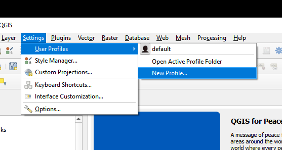
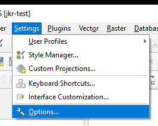
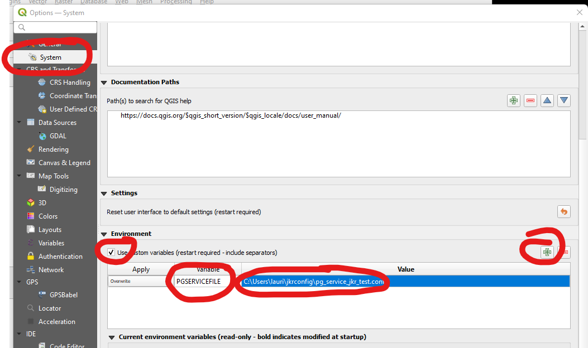
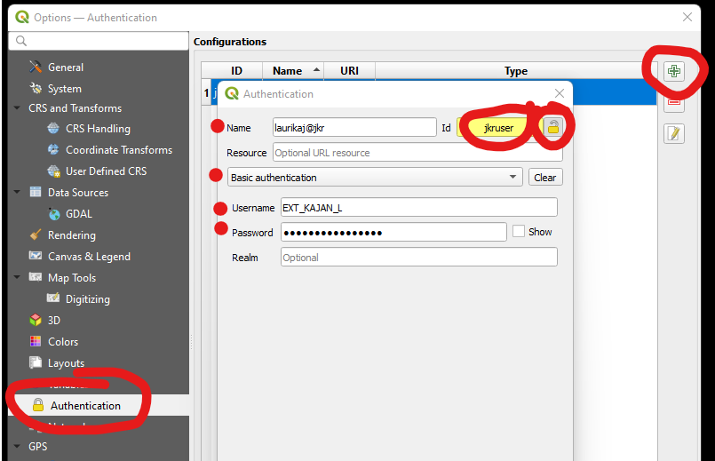
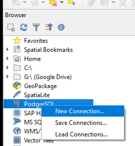
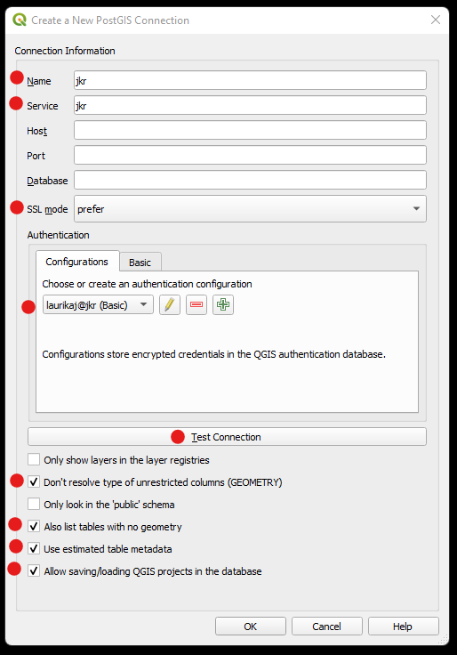
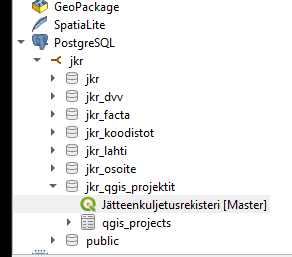

# Jätteenkuljetusrekisteri Core

This repository contains core parts of Jätteenkuljetusrekisteri including the data model and the importer tool.

This project is intended to be extended by customer specific modifications etc. import format plugins etc.

## Installing

You probably want install this to a virtual environment so your system python don't get cluttered of dependencies.

```bash
$ python -m venv jkr-venv
$ jkr-venv\scripts\activate
```

Download the whl file etc. `jkr-0.1.0-py3-none-any.whl`

```bash
(jkr-venv) $ pip install jkr-0.1.0-py3-none-any.whl
```

Now import script can be started

```bash
(jkr-venv) $ jkr import SIIRTOTIEDOSTO TIEDONTUOTTAJA
```

## Setting up a dev environment

The development environment uses [Poetry](https://python-poetry.org/). Install it before anything.

```bash
$ git clone https://github.com/punosmobile/jkr-core.git
$ cd jkr-core

$ poetry install

# Set up Git hooks to prevent committing sensitive data
$ git config core.hooksPath .hooks
```

### Db env

Install docker and docker-compose

Copy .env.template to %APPDATA%/jkr/.env and change parameters

```bash
$ cp .env.template .env.local

# Edit the .env file
$ nano .env.local
```

**Linux users only:** Before starting the database, you need to set up log directories and permissions:
```bash
# 1. Create required log directories
sudo mkdir -p ./docker/postgis/logs
sudo mkdir -p ./docker/postgis/test/logs

# 2. Set PostgreSQL user permissions for log directories
sudo chown -R 999:999 ./docker/postgis/logs
sudo chown -R 999:999 ./docker/postgis/test/logs
sudo chmod 777 ./docker/postgis/logs
sudo chmod 777 ./docker/postgis/test/logs
```


Start database
```bash
docker-compose -f dev.docker-compose.yml --env-file ".env.local" up -d db
```

Run migrations
```bash
docker-compose -f dev.docker-compose.yml --env-file ".env.local" up flyway
```

Optionally Scripts can be runned in container. First build image
```bash
docker build --pull --rm -f "Dockerfile" -t jkr-core-runner:latest "."
```

Start script-runner container
```bash
docker-compose -f dev.docker-compose.yml --env-file ".env.local" run jkr-core-runner
```

Scripts are working when data folder has structure:
data
├───DVV
├───Ilmoitus-\_ja_päätöstiedot
│ ├───Päätös-\_ja_ilmoitustiedot_2022
│ │ ├───Q1
│ │ ├───Q2
│ │ ├───Q3
│ │ └───Q4
│ ├───Päätös-\_ja_ilmoitustiedot_2023
│ │ ├───Q1
│ │ ├───Q2
│ │ ├───Q3
│ │ └───Q4
│ └───Päätös-\_ja_ilmoitustiedot_2024
│ ├───Q1
│ ├───Q2
│ └───Q3
├───Kuljetustiedot
│ ├───Kuljetustiedot_2022
│ │ ├───Q1
│ │ ├───Q2
│ │ ├───Q3
│ │ └───Q4
│ ├───Kuljetustiedot_2023
│ │ ├───Q1
│ │ ├───Q2
│ │ ├───Q3
│ │ └───Q4
│ └───Kuljetustiedot_2024
│ ├───Q1
│ ├───Q2
│ └───Q3
├───posti
└───Taajama-alueet_karttarajaukset

## Handling database model changes

The diff operation in pgModeler is quite fragile and not recommended used directly.

We use Flyway (for now) to generate database migrations. Flyway is a SQL file based migration system.
PgModeler is used to generate diff SQL files and then Flyway is used to apply the migrations.

### Create the initial migration

```bash
pgmodeler-cli.exe --export-to-file --input jkr.dbm --output migrations/V1__initial.sql --pgsql-ver 12.0
```

### Creating incremental migrations

```bash
# 1. Verify db is up to date (all current migrations applied) by running
docker-compose --env-file "${env:APPDATA}/jkr/.env" up flyway

# 2. Modify the pgmodeler model

# 3. Create a diff file. Change the conn-alias and output file.
pgmodeler-cli.exe --diff --save --input jkr.dbm --compare-to jkr --conn-alias local-db --output migrations/V2__add_sailio_table.sql --pgsql-ver 12.0

# 4. Validate and modify the migration file

# 5. Migrate by running
docker-compose --env-file "${env:APPDATA}/jkr/.env" up flyway

# 6. Verify all changes in model are apllied to the database by executing step 3 again and checking that no diff is generated.
```

**Repairing migrations**

```bash
docker-compose --env-file "${env:APPDATA}/jkr/.env" run --rm flyway repair
```

### Running migrations against different platform

```bash
docker-compose run --rm flyway migrate -user=jkr_admin -password=<password> -url=jdbc:postgresql://trepx-paikka1.tre.t.verkko:5432/ymparisto_test_db
```

## Using the QGIS project

The QGIS project reads data from a PostgreSQL service named `jkr` with a QGIS authentication which id is `jkruser`.

1. Create a PostgreSQL service file for each environment (Development, Testing, Production) to some folder for example in `<your home folder>/jkrconfig/`. Name the files for example `pg_service_jkr_dev.conf`, `pg_service_jkr_test.conf`, `pg_service_jkr_prod.conf`. Add the following with correct values for each environment:

```ini
[jkr]
host=localhost
port=5435
dbname=ymparisto_db
```

2. Create a QGIS-profile for each environment (Development, Testing, Production). Name the profiles for example `jkr-dev`, `jkr-test`, `jkr-prod`. A new QGIS window will open. Use that
   
3. In QGIS settings add a `PGSERVICEFILE` environment variable and fill the file path of corresponding service file as a value.
   
   
4. Restart QGIS to make the environment variable to take effect.
5. Create a authentication key to QGIS which ID is `jkruser`.
   
6. Create a new PostgreSQL connection
   
   
7. Open the QGIS project from the jkr-qgis-projektit -schema.
   

> **Development**
> For development use the [QGIS-project](qgis/jkr.qgs) can be used.

### Creating QGIS project migrations

QGIS project migrations are stored in `db/migrations/qgis-projektit/` directory. To create a new migration file for a QGIS project:

1. Make your changes to the QGIS project
2. Save the project to the database
3. Generate the migration SQL by running the following query in the database:

```sql
SELECT 
    format(
        'INSERT INTO jkr_qgis_projektit.qgis_projects VALUES (%L, %L, %L);',
        name,
        metadata::text,
        content
    )
FROM jkr_qgis_projektit.qgis_projects 
WHERE name = 'Jätteenkuljetusrekisteri [Master]';
```

4. Copy the query output to a new migration file in `db/migrations/qgis-projektit/` directory
5. Name the file following the Flyway naming convention: `V<version>__<description>.sql`
   - For example: `V3.00.0__Add_separate_layers_for_kohdetyypit.sql`

The migration will be applied when running Flyway migrations.

## Using jkr single command importer

In jkr-core/scripts/jkr_posti.sql, replace `<POSTI>` with the path to your posti file.

In jkr-core/scripts/import_and_create_kohteet.bat, replace the following lines to match your database connection:

```
SET HOST=<palvelimen nimi>
SET PORT=<tietokantaportti>
SET DB_NAME=<tietokannan_nimi>
SET USER=<kayttajatunnus>
```

The single command importer can be called with the following from the root.

```
jkr import_and_create_kohteet <POIMINTAPVM> <DVV> <PERUSMAKSU> <POSTI>
```

1. Replace <POIMINTAPVM> with the poimintapäivämäärä of DVV file you're about to import. Required.
1. Replace <DVV> with the filepath of DVV file you're about to import. Required.
1. Replace <PERUSMAKSU> with the filepath of perusmaksurekiseteri file you want to use.
   If you do not want to use perusmaksurekisteri, leave <PERUSMAKSU> out of the command.
1. Replace <POSTI> with "posti" (without quotation marks) if you want to import posti data.
   If you do not want to import posti data, leave <POSTI> out of the command.

## Picking smaller datasets

You can pick a subset of data for faster processing by using cherrypick_data.py script which can filter whole directory trees at once.

The scripts arguments look like this:
python cherrypick_data.py --rip_path [File or directory] --must_contain [postalCode] [municipality] [start of a postal code]

Example calls:
- `python cherrypick_data.py --rip_path ../data/ --must_contain lahti heinola 171*`
- `python cherrypick_data.py --rip_path ../data/ --must_contain 17100 17200`

Note that it is recommended to include target municipality id/ sijainti-kunta value to ensure all owners located in the given area are included in the data

## Testing

Tests run inside Docker containers. The test runner script creates a fresh test database, runs Flyway migrations, and executes pytest automatically. No local Python environment is needed for running the tests.

### Prerequisites

- Docker and Docker Compose installed and running
- `.env.local` in the project root with the following variables:

```ini
JKR_TEST_DB=jkr_test
JKR_TEST_DB_PORT=5436
JKR_TEST_PASSWORD=qwerty
JKR_USER=jkr_admin
```

You can copy `.env.template` as a starting point: `cp .env.template .env.local`

### Running tests

#### Windows (PowerShell)

```powershell
# Interactive menu (default: run all)
.\tests\scripts\run_tests.ps1

# Run all tests directly
.\tests\scripts\run_tests.ps1 --all

# Run a single test file
.\tests\scripts\run_tests.ps1 --test test_kompostori
```

#### Linux / macOS (Bash)

```bash
# Make executable (first time only)
chmod +x tests/scripts/run_tests.sh

# Interactive menu (default: run all)
./tests/scripts/run_tests.sh

# Run all tests directly
./tests/scripts/run_tests.sh --all

# Run a single test file
./tests/scripts/run_tests.sh --test test_kompostori
```

The `--test` flag accepts the test file name with or without the `test_` prefix and `.py` extension. If the test file is not found, the script lists all available tests.

The test database container keeps running after the tests finish to allow manual inspection. Stop it with `docker stop jkr_test_database`.

### Container scripts

When tests run inside a Docker container (via `testing.docker-compose.yml`), the following scripts are used automatically:

- **`tests/scripts/init_database_container.sh`** – Initializes the test database inside the container. Imports DVV test data and postal codes (Flyway migrations are already handled by Docker Compose).
- **`tests/scripts/update_database_container.sh`** – Updates the test database with `DVV_update.xlsx` inside the container. Used by tests that verify DVV data updates.

```bash
# Make executable (first time only)
chmod +x tests/scripts/init_database_container.sh
chmod +x tests/scripts/update_database_container.sh
```

### Running tests without database (lightweight tests)

Some tests do not require a database connection and can be run independently:

```bash
python -m pytest tests/test_liete_kuljetustiedot.py tests/test_kaivotiedot.py tests/test_liete_ilmoitukset.py tests/test_intervals.py tests/test_date_utils.py -v
```

> **Note:** If your environment contains saved environmental variables, they may cause issues with the tests.

### Test data

The data used in tests (`/tests/data`) is mostly dummy data created only for testing fixtures. Currently, there is only one exception.

#### Postal code data

The postal code data (`/tests/data/test_data_import`) is real data downloaded from Postal Code Services by Posti. Please see the current service description and terms of use if you share this data further. [Service description and terms of use](https://www.posti.fi/mzj3zpe8qb7p/1eKbwM2WAEY5AuGi5TrSZ7/c76a865cf5feb2c527a114b8615e9580/posti-postal-code-services-service-description-and-terms-of-use-20150101.pdf)

### Test scopes

The automated tests test a wide variety of features within the data import processes

| File | Test class | Test description |
|-------|------------|-----------------|
| akppoistosyy | test_akppoistosyyt | Verifies the AKP removal types in authority decisions |
| data_import | test_osapuolenrooli | Verifies the existence of correct role types for parties |
|  | test_import_dvv_kohteet | Verifies the number of objects created from the base fee register, start dates, owners, end date presence, number of oldest residents, the oldest resident's party link, formation and existence of transport contracts on the correct object |
|  | test_update_dvv_kohteet | Verifies end date updates, correct parties, missing party for unknown object, transfer of decisions and notifications, formation of client role from transport, old decision ending and new one starting, composting changes and retention |
| date_utils | test_parse_date | Verifies that date parsing still works correctly |
|  | test_invalid_date_should_raise | Verifies that invalid date raises an error |
| db_utils | test_is_asoy | Verifies that the housing company detector works correctly |
|  | test_is_company | Verifies that the company detector works correctly |
| interval | test_range_overlap | Verifies that interval overlap checking works |
|  | test_range_contains | Verifies that number containment in interval works |
|  | test_interval_counter_containing | Verifies that interval counter works |
|  | test_interval_overlapping | Verifies the count of overlapping intervals |
| kitu | test_short_kitu_2_long | Verifies the interpretation of short KITU codes |
| kompostori_end_dates | test_readable | Verifies the readability of compost end notification xlsx file |
|  | test_lopetusilmoitus | Verifies the ending of two composters and recording of two unmatched composters |
| kompostori | test_readable | Verifies the readability of notification file |
|  | test_kompostori | Verifies creation of two composters, two unmatched, one rejected, and three composter objects |
|  | test_kompostori_osakkaan_lisays | Verifies importing additional composter owner notifications, existence of three composter objects |
| lahti_siirtotiedosto | test_tiedontuottaja_add_new | Verifies adding a data producer |
|  | test_readable | Verifies readability of CSV files in directory |
|  | test_kohteet | Verifies that contractor ID exists in customer data |
|  | test_import_faulty_data | Verifies error with faulty data |
|  | test_import_data | Verifies no new objects are created, end dates are unchanged, contract count, contract types (including shared), client roles by waste type, shared owners, shared managers, area collection contracts, unknown contract and transport, fixed waste mass, emptying intervals including per waste type, interruptions, unmatched count, unmatched PRT correction and resulting contract |
| päätöstulos | test_paatostulos | Verifies decision result types |
| progress | test_progress | Verifies reporting progress |
|  | test_progress_reset | Verifies reporting progress reset |
| tapahtumalajit | test_tapahtumalajit | Verifies event types |
| viranomaispäätöset | test_readable | Verifies readability of decision file |
|  | test_import_faulty_data | Verifies failure with bad data |
|  | test_import_paatokset | Verifies number of authority decisions, decision numbers, dates, positive and negative decisions, event type, AKP removal reason, matching, emptying interval, waste type, unmatched list |
| liete_kuljetustiedot | TestLieteKuljetusRow | Verifies LIETE transport data parsing: dates, floats, identifiers |
|  | TestLieteKuljetustiedosto | Verifies Excel file reading for LIETE transport data |
|  | TestLieteJatelajiMap | Verifies waste type mapping (Musta→mustaliete, Harmaa→harmaaliete) |
|  | TestLieteTranslator | Verifies translation to JKR format, customer grouping by PRT |
| kaivotiedot | TestParseBool | Verifies boolean parsing from various formats (x, 1, type name) |
|  | TestParseDate | Verifies date parsing from Finnish and ISO formats |
|  | TestKaivotiedotRow | Verifies well data row model and type detection |
|  | TestKaivotiedosto | Verifies Excel file reading for well data start/end |
|  | TestKaivotietotyyppiIdMap | Verifies well type ID mapping |
| liete_ilmoitukset | TestLieteIlmoitustiedosto | Verifies LIETE composting notification file reading |
|  | TestLieteIlmoitusTranslator | Verifies translation to JKR format, pienpuhdistamo date handling |

## Naming development branches

Because this repository is developed mostly in customer specific projects the label of the project may be good to be included in the branch name. The preferred naming convention is `{label-of-project}-{issue-in-that-project}/{description}`. For example, `"Lahti-99/kuljetustietojen-tallennus"`. Please avoid umlauts and use hyphens as separators.

## Using Pseydonymized data

You can pseudonymize data for secure data transfer or development purposes using our two-way encryption script pseudonymisointi.py which can pseudonymize whole directory trees at once.

Instructions:
 1. Generate or decide on a password to use during encryption
 2. Run python `luo_suola_pseydolle.py` to generate a random salt, save this securely if you intend to decrypt the data later
 3. Run `python pseudonymisointi.py [Path to file or directory] --passw [Password] --salt [Random salt from luo_suola_pseydolle] --pseudo_fields [A list or a path to a json file containing a list of columns to pseudonymize] -d false` 

 To decrypt data, the process is otherwise the same but you must use the same salt and password as you used during encryption and add the `-d` flag with a value of `true` at which point the code will reverse the encryption
 
 Example calls :
 - `python pseudonymisointi.py ../pseudonyms/ --passw test123 --salt FGKHNsGl6U8PtsMCBMw6AQ== --pseudo_fields @pseudofields.json -d true`
 - `python pseudonymisointi.py ../pseudonyms/ --passw test123 --salt FGKHNsGl6U8PtsMCBMw6AQ== --pseudo_fields '["Henkilötunnus","Nimi"]' -d false`

 Pseudofields.json should look like this:
 `[
    "Henkilötunnus",
    "Omistajan nimi",
    "Nimi",
    "Osoite",
    "Huoneiston vanhin asukas (henkilötunnus)",
    "Sukunimi",
    "Etunimi",
    "Etunimet",
    "Toimijanimi",
    "Haltijannimi"
]`

### Git Hooks

This project uses Git hooks to prevent accidentally committing sensitive data. The pre-commit hook checks for patterns like API keys, passwords, and other sensitive information. If you need to commit a file that contains sensitive data (e.g., test configurations), add the file path to `.allowCommit` file.
